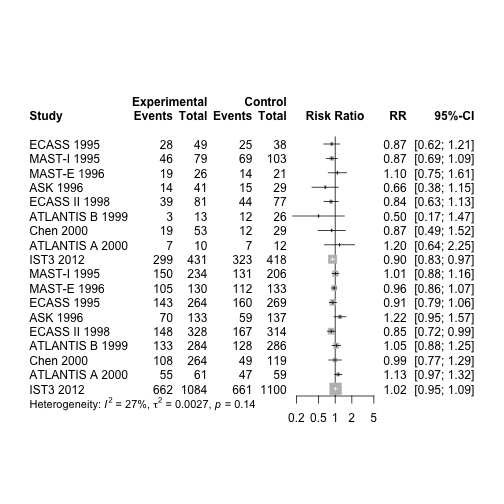
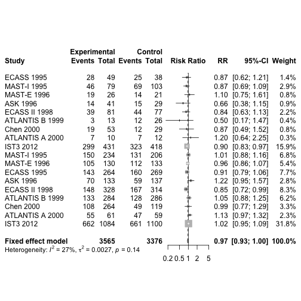
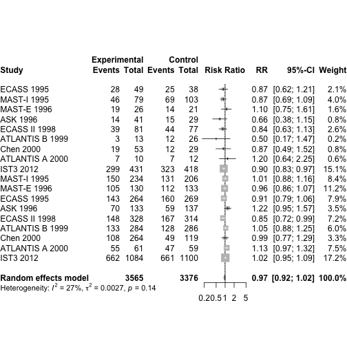

Meta-analysis: an introduction
========================================================
author: Paolo Eusebi
date: 24/02/2021
autosize: true

Outline
========================================================

- Sums and ratios
- Heterogeneity
- Fixed effects model
- Random effects model

Definition
========================================================

Meta-analysis is a quantitative approach for systematically combining results of  previous studies to arrive at conclusions about the body of research

* Quantitative: numbers 
* Systematic: methodical 
* Combining: putting together / summing up
* Previous research: already done 
* Conclusions: new knowledge 

A study collects data from individual subjects (such as 100 subjects = 100 “data points”). 

A meta-analysis collects data from individual studies (such as 100 studies = 100 “data points”)

Why
========================================================

1. Identify heterogeneity in effects among multiple studies and, where appropriate, provide summary measure
2. Increase statistical power and precision to detect an effect
3. Develop, refine and test hypothesis
4. Reduce the subjectivity of study comparisons by using systematic and explicit comparison procedure
5. Identify data gap in the knowledge base and suggest direction for future research
6. Calculate sample size for future studies

Could we just add the data from all the trials togheter?
========================================================

* One approach to combining trials would be to add all the treatment groups together, add all the control groups together, and compare the totals
*This is wrong for several reasons, and it can give the wrong answer
* Breaks the power of randomization
* Imbalances within trials introduce bias

Thrombolysis in Stroke (Cochrane Review 2014)
========================================================
<table class="table table-striped" style="font-size: 11px; width: auto !important; margin-left: auto; margin-right: auto;">
 <thead>
  <tr>
   <th style="text-align:left;"> Study </th>
   <th style="text-align:right;"> Year </th>
   <th style="text-align:right;"> d.trom </th>
   <th style="text-align:right;"> n.trom </th>
   <th style="text-align:right;"> d.cont </th>
   <th style="text-align:right;"> n.cont </th>
  </tr>
 </thead>
<tbody>
  <tr>
   <td style="text-align:left;"> ECASS </td>
   <td style="text-align:right;"> 1995 </td>
   <td style="text-align:right;"> 28 </td>
   <td style="text-align:right;"> 49 </td>
   <td style="text-align:right;"> 25 </td>
   <td style="text-align:right;"> 38 </td>
  </tr>
  <tr>
   <td style="text-align:left;"> MAST-I </td>
   <td style="text-align:right;"> 1995 </td>
   <td style="text-align:right;"> 46 </td>
   <td style="text-align:right;"> 79 </td>
   <td style="text-align:right;"> 69 </td>
   <td style="text-align:right;"> 103 </td>
  </tr>
  <tr>
   <td style="text-align:left;"> MAST-E </td>
   <td style="text-align:right;"> 1996 </td>
   <td style="text-align:right;"> 19 </td>
   <td style="text-align:right;"> 26 </td>
   <td style="text-align:right;"> 14 </td>
   <td style="text-align:right;"> 21 </td>
  </tr>
  <tr>
   <td style="text-align:left;"> ASK </td>
   <td style="text-align:right;"> 1996 </td>
   <td style="text-align:right;"> 14 </td>
   <td style="text-align:right;"> 41 </td>
   <td style="text-align:right;"> 15 </td>
   <td style="text-align:right;"> 29 </td>
  </tr>
  <tr>
   <td style="text-align:left;"> ECASS II </td>
   <td style="text-align:right;"> 1998 </td>
   <td style="text-align:right;"> 39 </td>
   <td style="text-align:right;"> 81 </td>
   <td style="text-align:right;"> 44 </td>
   <td style="text-align:right;"> 77 </td>
  </tr>
  <tr>
   <td style="text-align:left;"> ATLANTIS B </td>
   <td style="text-align:right;"> 1999 </td>
   <td style="text-align:right;"> 3 </td>
   <td style="text-align:right;"> 13 </td>
   <td style="text-align:right;"> 12 </td>
   <td style="text-align:right;"> 26 </td>
  </tr>
  <tr>
   <td style="text-align:left;"> Chen </td>
   <td style="text-align:right;"> 2000 </td>
   <td style="text-align:right;"> 19 </td>
   <td style="text-align:right;"> 53 </td>
   <td style="text-align:right;"> 12 </td>
   <td style="text-align:right;"> 29 </td>
  </tr>
  <tr>
   <td style="text-align:left;"> ATLANTIS A </td>
   <td style="text-align:right;"> 2000 </td>
   <td style="text-align:right;"> 7 </td>
   <td style="text-align:right;"> 10 </td>
   <td style="text-align:right;"> 7 </td>
   <td style="text-align:right;"> 12 </td>
  </tr>
  <tr>
   <td style="text-align:left;"> IST3 </td>
   <td style="text-align:right;"> 2012 </td>
   <td style="text-align:right;"> 299 </td>
   <td style="text-align:right;"> 431 </td>
   <td style="text-align:right;"> 323 </td>
   <td style="text-align:right;"> 418 </td>
  </tr>
  <tr>
   <td style="text-align:left;"> MAST-I </td>
   <td style="text-align:right;"> 1995 </td>
   <td style="text-align:right;"> 150 </td>
   <td style="text-align:right;"> 234 </td>
   <td style="text-align:right;"> 131 </td>
   <td style="text-align:right;"> 206 </td>
  </tr>
  <tr>
   <td style="text-align:left;"> MAST-E </td>
   <td style="text-align:right;"> 1996 </td>
   <td style="text-align:right;"> 105 </td>
   <td style="text-align:right;"> 130 </td>
   <td style="text-align:right;"> 112 </td>
   <td style="text-align:right;"> 133 </td>
  </tr>
  <tr>
   <td style="text-align:left;"> ECASS </td>
   <td style="text-align:right;"> 1995 </td>
   <td style="text-align:right;"> 143 </td>
   <td style="text-align:right;"> 264 </td>
   <td style="text-align:right;"> 160 </td>
   <td style="text-align:right;"> 269 </td>
  </tr>
  <tr>
   <td style="text-align:left;"> ASK </td>
   <td style="text-align:right;"> 1996 </td>
   <td style="text-align:right;"> 70 </td>
   <td style="text-align:right;"> 133 </td>
   <td style="text-align:right;"> 59 </td>
   <td style="text-align:right;"> 137 </td>
  </tr>
  <tr>
   <td style="text-align:left;"> ECASS II </td>
   <td style="text-align:right;"> 1998 </td>
   <td style="text-align:right;"> 148 </td>
   <td style="text-align:right;"> 328 </td>
   <td style="text-align:right;"> 167 </td>
   <td style="text-align:right;"> 314 </td>
  </tr>
  <tr>
   <td style="text-align:left;"> ATLANTIS B </td>
   <td style="text-align:right;"> 1999 </td>
   <td style="text-align:right;"> 133 </td>
   <td style="text-align:right;"> 284 </td>
   <td style="text-align:right;"> 128 </td>
   <td style="text-align:right;"> 286 </td>
  </tr>
  <tr>
   <td style="text-align:left;"> Chen </td>
   <td style="text-align:right;"> 2000 </td>
   <td style="text-align:right;"> 108 </td>
   <td style="text-align:right;"> 264 </td>
   <td style="text-align:right;"> 49 </td>
   <td style="text-align:right;"> 119 </td>
  </tr>
  <tr>
   <td style="text-align:left;"> ATLANTIS A </td>
   <td style="text-align:right;"> 2000 </td>
   <td style="text-align:right;"> 55 </td>
   <td style="text-align:right;"> 61 </td>
   <td style="text-align:right;"> 47 </td>
   <td style="text-align:right;"> 59 </td>
  </tr>
  <tr>
   <td style="text-align:left;"> IST3 </td>
   <td style="text-align:right;"> 2012 </td>
   <td style="text-align:right;"> 662 </td>
   <td style="text-align:right;"> 1084 </td>
   <td style="text-align:right;"> 661 </td>
   <td style="text-align:right;"> 1100 </td>
  </tr>
</tbody>
</table>

Forest plot
========================================================

What is heterogeneity
========================================================
**Definition**

Heterogeneity is the variation between the studies results.

**Sources**

* Patients: diagnosis, in- and exclusion criteria, etc.

* Interventions: type, dose, duration, etc.

* Outcomes: type, scale, cut-off points, duration of follow-up, etc.

* Quality and methodology: randomised or not, allocation concealment, blinding, etc.

* ...

How to look for heterogeneity
========================================================

**Forest plot**

Do confidence intervals of studies overlap with each other and the summary effect?

**Statistics**

* Chi-square test for heterogeneity (Mantel-Haenszel test or Cochran Q test)
Tests whether the individual effects are farther away from the common effect, beyond what is expected by chance. Poor power (P-value < 0.10 indicates significant heterogeneity)

* $I^2$ 

How to deal with heterogeneity
========================================================

* Do not pool at all

* Ignore heterogeneity: use fixed effect model

* Allow for heterogeneity: use random effects model

* Explore heterogeneity

Fixed effect meta-analysis
========================================================

Fixed effect meta-analysis
========================================================

Fixed effects model assumes that the true effect of treatment is the same value in each study.

**Specific methods for combining odds ratio** 

1. Mantel- Haenszel method 
2. Peto‟s method 
3. Maximum-Likelihood 
4. Exact methods of interval estimation

Random effect meta-analysis
========================================================

Random effect meta-analysis
========================================================
The treatment effects for the individual studies are assumed to vary around some overall average treatment effect 

* Allows for random error plus inter-study variability 
* Results in wider confidence intervals (more conservative)
* Studies tend to be weighted more equally (relatively more weight is given to smaller studies)

Random effect meta-analysis
========================================================
There are five approach for this model:

1. Weighted least squares 
2. Un-weighted least squares 
3. Maximum likelihood 
4. Restricted Maximum likelihood 
5. Exact approach to random effects of binary data.
